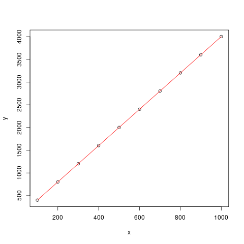

# Homework 1
Tristan Rice, q7w9a, 25886145

## Question 2b

```erlang
20> hw1:allTails(lists:seq(1000,1010)).
[[],
 [1010],
 [1009,1010],
 [1008,1009,1010],
 [1007,1008,1009,1010],
 [1006,1007,1008,1009,1010],
 [1005,1006,1007,1008,1009,1010],
 [1004,1005,1006,1007,1008,1009,1010],
 [1003,1004,1005,1006,1007,1008,1009,1010],
 [1002,1003,1004,1005,1006,1007,1008,1009,1010],
 [1001,1002,1003,1004,1005,1006,1007,1008,1009,1010],
 [1000,1001,1002,1003,1004,1005,1006,1007,1008,1009,1010]]
```

## Question 3

```erlang
21> [ {N, erts_debug:size(hw1:allTails(lists:seq(1,N)))}
21> || N <- lists:seq(100,1000,100)
21> ].
[{100,402},
 {200,802},
 {300,1202},
 {400,1602},
 {500,2002},
 {600,2402},
 {700,2802},
 {800,3202},
 {900,3602},
 {1000,4002}]
```

### a)

From the output of the above command we can see that memory used $ = 4*N+2$.

While there is some overhead. It appears that erlang does some sort of
deduplication. Using a naive approach one would expect that it would use a
constant amount of space for each element leading to something close to

$$ \sum_{i=1}^n i = \frac{n(n+1)}2 $$

which is clearly not the case since it's not using exponentially more space as n
increases and only linear.

Thus, it appears that for each sub list of the produced list, it is only storing
a "pointer" to the index of the original list.

### b)

\

x is N, y is memory useage.

Line of best fit is $y(x) = 4*x+2$. Obtained by looking at data and testing.
