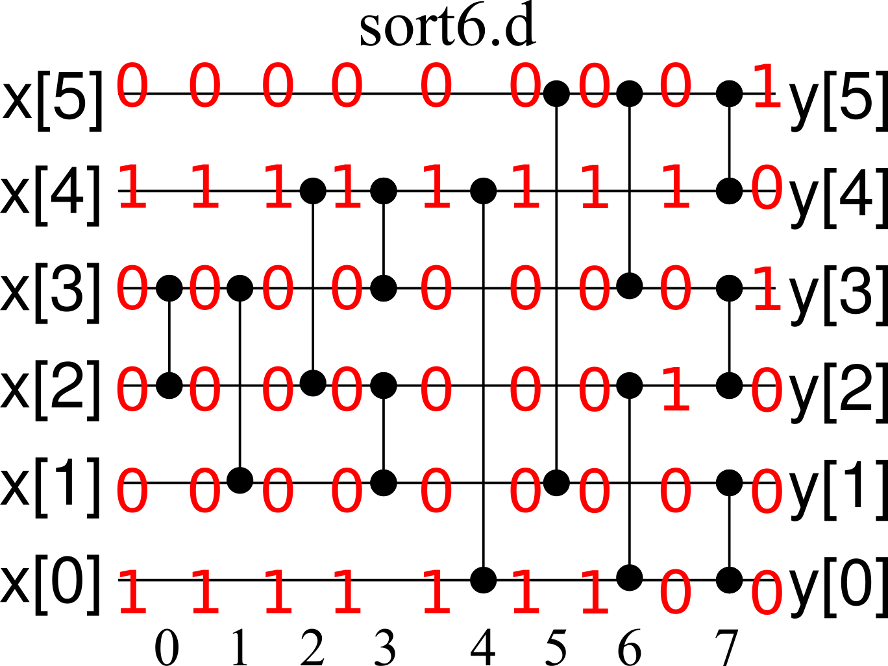

# CPSC 418 - Homework 4
Tristan Rice, q7w9a, 25886145

## 1

### a

```
0-*---------
1-|-*-------
2-|-|-*-----
3-|-|-|-*---
4-|-|-|-|-*-
5-|-|-|-|-*-
6-|-|-|-*---
7-|-|-*-----
8-|-*-------
9-*---------
```

### b) Prove that either the sequence y[0, ..., (N/2) − 1] is clean or that the sequence y[(N/2), ..., (N − 1)] is clean (or possibly both).

Proof. There are three main cases, when there are more ones than zeros, more
zeros than ones, and when the number of zeros equals the number of ones.

#### Case 1:

When there are more ones than zeros, it's impossible for both halves to be
clean. However, one half can be clean. When the two arrays are reversed and
compared, there will be overlap between the ones, leading to them not being
switched. However, since the side with the maximum values also contains a one,
it will become clean.

```
1
1
0
1
1
0
```

Reverse

```
1 0
1 1
0 1
```

Compare

```
1 0
1 1
1 0
```

#### Case 2:

Case 2 is the inverse of case 1, and the same rule applies by swapping 0 with 1.

#### Case 3:

When there are an equal number of ones and zeros, the number of ones in the
first half will equal the number of zeros in the second half. When this sorting
network is applied, the second half of the values are reversed and compared with
the bottom half. Thus, both halves will be clean.

```
1
1
0
1
0
0
```

Reverse

```
1 0
1 0
0 1
```

Compare

```
1 0
1 0
1 0
```

### c

In the case that both sequences are clean, both of the sequences are bitonic.

When there is an inequal number of zeros and ones, one of the arrays will be
clean and thus bitonic. The other is a mix of ones and zeros. We can see that it
is also bitonic by looking at how the numbers are reversed and compared. Since
the sequences are reversed before being compared, the high values of one
sequence are being compared to the low values of the other sequence. Thus, the
values which will be the same are located in the middle by the intermediate
value theorem. Therefore, the sequence is bitonic since all duplicate values are
in the middle.

### d

Proof by contradiction:

Assume there is some $i$ and $j$ such that $y[i] > y[j]$. Since we are applying
the 0-1 principle, that means $y[i]=1, y[j]=0$. Using the earlier proof, we know
that one of the output sequences will be clean and thus have all the same
values. Either the top sequence will be all 1s or the bottom sequence will
be all 0s. This is a contradictions since we assumed that there was a 0 in the
top sequence and a 1 in the bottom sequence. Thus, $0\leq i \leq (N/2)$ and
$(N/2)\leq j \leq N, y[i] \leq y[j]$.

## 2

### a

from sort6.c:
  column 0: (1,2)

### b

from sort6.c:
  column 0: (1, 2)
  column 1: (0, 1)
  column 2: (1, 2)

### c

from sort6.b:
  column 4: (1, 2), (3, 4)
  column 5: (2, 4)
  column 6: (1, 3)
  column 7: (2, 3)


### d

from sort6.c:
  column 3: (0, 5)
  column 4: (1, 4)
  column 5: (2, 3)

### e

sort6.d does not sort correctly.

\


### f

sort6.c does sort correctly.

Since it's a sorting network the output must be sorted. If there's a 1 in
$x[0, \ldots, (N-1)]$, for the output to be sorted $y[5]$ must be sorted.

### g

sort6.c consists of 5 subparts from previous parts of this question. There's
initially two 3 input sorters which sort $x[3,\ldots,5]$ and $x[0,\ldots,2]$.
This produces two sorted sequences. From our proofs from question one, we know
the columns 3 to 5 make sure that all the values in the top half of the sorting
network are greater than the bottom half. The last two subnetwork on lines 6-8,
enforce that the top 3 values and the bottom 3 values are sorted. Since we know
the top 3 values are larger or equal to the bottom 3 values, the entire sequence
must be sorted.


### h

Both sort6.a and sort6.b sort correctly.

## 3

Using: lin13.ugrad.cs.ubc.ca

### b

```
q7w9a@lin13  ~/cs418/hw4   master ●  ./a.out f 10000000 10000
f(n, ...): t_elapsed =  5.960e-01, throughput =  2.040e+09
 q7w9a@lin13  ~/cs418/hw4   master ●  ./a.out f 1000000 10000
f(n, ...): t_elapsed =  1.400e-01, throughput =  1.007e+10
 q7w9a@lin13  ~/cs418/hw4   master ●  ./a.out f 256 10000
f(n, ...): t_elapsed =  8.000e-03, throughput =  3.200e+08
 q7w9a@lin13  ~/cs418/hw4   master ●  ./a.out f 256 1000000
f(n, ...): t_elapsed =  5.200e-02, throughput =  4.923e+09
 q7w9a@lin13  ~/cs418/hw4   master ●  ./a.out f 256 10000000
f(n, ...): t_elapsed =  2.360e-01, throughput =  1.085e+10
 q7w9a@lin13  ~/cs418/hw4   master ●  ./a.out f 256 100000000
f(n, ...): t_elapsed =  2.948e+00, throughput =  1.399e+09
 q7w9a@lin13  ~/cs418/hw4   master ●  ./a.out f 512 1000000
f(n, ...): t_elapsed =  5.600e-02, throughput =  9.143e+09
 q7w9a@lin13  ~/cs418/hw4   master ●  ./a.out f 512 5000000
f(n, ...): t_elapsed =  1.480e-01, throughput =  1.730e+10
 q7w9a@lin13  ~/cs418/hw4   master ●  ./a.out f 1024 25000000
f(n, ...): t_elapsed =  6.240e-01, throughput =  6.611e+09
 q7w9a@lin13  ~/cs418/hw4   master ●  ./a.out f 1024 2500000
f(n, ...): t_elapsed =  7.200e-02, throughput =  3.556e+10
 q7w9a@lin13  ~/cs418/hw4   master ●  ./a.out f 65536 2500000
f(n, ...): t_elapsed =  2.364e+00, throughput =  2.670e+08
 q7w9a@lin13  ~/cs418/hw4   master ●  ./a.out f 1024 2500000
f(n, ...): t_elapsed =  8.400e-02, throughput =  3.048e+10
 q7w9a@lin13  ~/cs418/hw4   master ●  ./a.out f 1024 3000000
f(n, ...): t_elapsed =  1.000e-01, throughput =  3.072e+10
 q7w9a@lin13  ~/cs418/hw4   master ●  ./a.out f 2048 1500000
f(n, ...): t_elapsed =  4.800e-02, throughput =  6.400e+10
 q7w9a@lin13  ~/cs418/hw4   master ●  ./a.out f 2048 3000000
f(n, ...): t_elapsed =  8.000e-02, throughput =  2.311e+10
 q7w9a@lin13  ~/cs418/hw4   master ●  ./a.out f 2048 3000000
f(n, ...): t_elapsed =  1.040e-01, throughput =  1.778e+10
 q7w9a@lin13  ~/cs418/hw4   master ●  ./a.out f 2048 3000000
f(n, ...): t_elapsed =  8.400e-02, throughput =  2.201e+10
 q7w9a@lin13  ~/cs418/hw4   master ●  ./a.out f 2048 1500000
f(n, ...): t_elapsed =  4.400e-02, throughput =  6.982e+10
 q7w9a@lin13  ~/cs418/hw4   master ●  ./a.out f 2048 1000000
f(n, ...): t_elapsed =  2.800e-02, throughput =  7.314e+10
 q7w9a@lin13  ~/cs418/hw4   master ●  ./a.out f 2048 100000
f(n, ...): t_elapsed =  1.200e-02, throughput =  1.707e+10
 q7w9a@lin13  ~/cs418/hw4   master ●  ./a.out f 2048 1000000
f(n, ...): t_elapsed =  4.000e-02, throughput =  5.120e+10
 q7w9a@lin13  ~/cs418/hw4   master ●  ./a.out f 2048 1000000
f(n, ...): t_elapsed =  3.600e-02, throughput =  5.689e+10
 q7w9a@lin13  ~/cs418/hw4   master ●  ./a.out f 2048 1000000
f(n, ...): t_elapsed =  2.400e-02, throughput =  8.533e+10
 q7w9a@lin13  ~/cs418/hw4   master ●  ./a.out f 2048 1000000
f(n, ...): t_elapsed =  3.200e-02, throughput =  6.400e+10
 q7w9a@lin13  ~/cs418/hw4   master ●  ./a.out f 2048 1500000
f(n, ...): t_elapsed =  5.200e-02, throughput =  5.908e+10
 q7w9a@lin13  ~/cs418/hw4   master ●  ./a.out f 3048 1500000
f(n, ...): t_elapsed =  5.600e-02, throughput =  4.947e+09
 q7w9a@lin13  ~/cs418/hw4   master ●  ./a.out f 4096 1500000
f(n, ...): t_elapsed =  8.800e-02, throughput =  2.101e+10
 q7w9a@lin13  ~/cs418/hw4   master ●  ./a.out f 4096 15000000
f(n, ...): t_elapsed =  8.840e-01, throughput =  1.482e+09
 q7w9a@lin13  ~/cs418/hw4   master ●  ./a.out f 4096 1500000
f(n, ...): t_elapsed =  1.000e-01, throughput =  1.849e+10
```

Through experimentation, I found that $n=2048$ and $m=1000000$ had the highest
throughput at 8.533e10/s iterations of the inner loop of the kernel. Each of
those iterations requires 4 multiplies and 1 add which means 4 floating point
operations since there's a combined multiply/add operation. Thus, we achieve a
performance of 341.32GFlops.


### c

```
q7w9a@lin13  ~/cs418/hw4   master ●  ./a.out f_cpu 2048 1000000
f_cpu(n, ...): t_elapsed =  1.336e+01, throughput =  1.533e+08
```

Speed up of: 13.36/2.400e-02=566.67

### d

When writing cuda operations you want to maximize utilization of the cores as
well as have a high enough ratio of floating point operations to memory
operations to not be blocked by memory bandwidth. With a large M value, there's
a lot of floating point operations for every memory access. It's also good to
have the number of kernels be a multiple of the number of threads so you don't
have any wasted computations. The number of threads should be sufficiently large
as to make full use of all the cores.

## 4

### a

Running on lin13.ugrad.cs.ubc.ca. N = 50000000

```
q7w9a@lin13  ~/cs418/hw4   master ●  ./a.out saxpy 50000000
saxpy(n, ...): t_elapsed =  1.000e-01
```

### b

```
 q7w9a@lin13  ~/cs418/hw4   master ●  ./a.out saxpy_cpu 50000000
saxpy_cpu(n, ...): t_elapsed =  1.440e-01
```

You get a 1.44 performance speedup by using the GPU and CUDA.

### c

On each thread in the GPU, saxpy does a single multiply+add floating point
operation. This is a very poor use of the GPU since it is mostly blocked by
memory bandwidth to load those values into the GPU. In question 3, there's a
much larger speedup since the computation has a much higher FMA count to memory
access ratio.

If you make the implementation do way more FMA operations in the kernel, the
performance differences are much more stark.

Let's do 10 iterations of the inner operation instead.

```c
float yi = y[i];
float xi = x[i];
float out;
for (int j = 0; j<10; j++) {
  out = a*xi + yi;
}
y[i] = out;
```

```
 q7w9a@lin13  ~/cs418/hw4   master ●  ./a.out saxpy 50000000
saxpy(n, ...): t_elapsed =  1.040e-01
 q7w9a@lin13  ~/cs418/hw4   master ●  ./a.out saxpy_cpu 50000000
saxpy_cpu(n, ...): t_elapsed =  8.760e-01
```

We see that the GPU and CUDA implementation only slows down by 4% whereas the
CPU implementation slows down roughly 500%. This very clearly indicates that the
memory accesses are the blocker.


